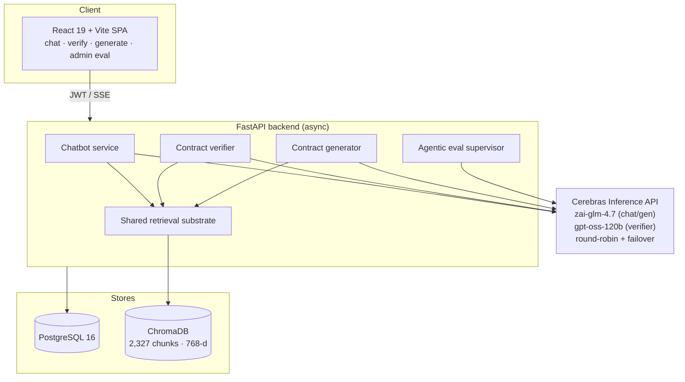
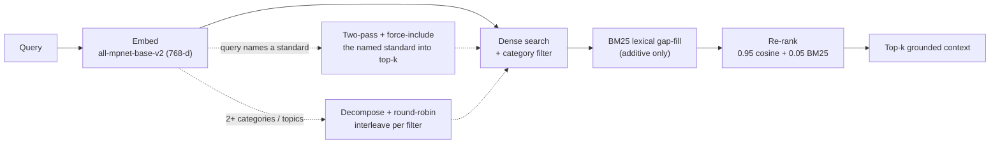
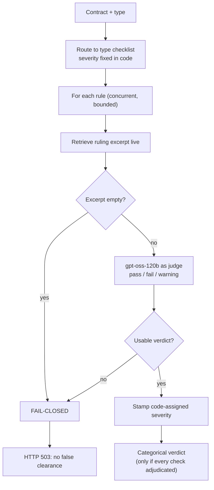

# QIST

**An AAOIFI-grounded AI platform for Islamic finance: a retrieval-grounded chatbot, a clause-by-clause contract verifier, and a compliance-aware contract generator, over one shared retrieval substrate.**

<p>
  
  
  
  
  
  
  
  
</p>

> *Qist* (قسط) is the Arabic word for fairness and just measure, the principle the platform is built to serve.

QIST unifies three services over a single corpus of the AAOIFI Islamic-finance standards: a grounded question-answering chatbot, a rule-anchored contract verifier, and an AAOIFI-aligned contract generator. It covers the six contract families admitted under both AAOIFI and Algerian participation-banking regulation: **murabaha, salam, mudharabah, musharaka, istisna, and ijara**.

The guiding principle is **grounding**: every Shariah judgement the system issues, whether an answer, a verification finding, or a generated clause, is derived from a corpus passage retrieved at the moment it is needed and is traceable to a specific standard and section. The authoritative rulings live in the corpus, not in application code. Across the six families, the verifier reported **no defective contract as compliant** on any of the 91 scored fixtures.

> This was my end-of-studies engineering project (State Engineer + Master's, National Polytechnic School of Algiers), built during an internship at ThynkTechDz and defended with the jury's commendation (17.75/20). I started it without knowing what an LLM or a RAG pipeline was and taught myself the full stack to ship it.

> **Source access:** this repository presents the system design and results. The full source is maintained privately while the project is being taken toward commercialization, and is available for a walkthrough or review on request.

---

## Demo

[](https://youtu.be/vMkaDsl3pbo)

**[Watch the full system demo](https://youtu.be/vMkaDsl3pbo)** (YouTube)

**What the walkthrough shows, in order:**

1. **Grounded answer**: log in and ask the chatbot a question; the answer returns with grounding references, the standards it draws on.
2. **Structure recommendation**: describe a financing situation in plain language, and the system suggests the contract type that fits.
3. **Draft**: click generate, and it drafts the contract.
4. **Verification**: the verifier returns findings; each failed check names the clause, the rule it breaches, the AAOIFI authority, and a suggested fix.
5. **Fix in chat**: click fix, and it regenerates from those findings and the prior draft.
6. **Re-verification**: a second verification returns a compliant result.
7. **Admin**: the ingested standards with upload and delete, and the evaluation dashboard.

---

## Table of contents

- [Demo](#demo)
- [What it does](#what-it-does)
- [What's different about this](#whats-different-about-this)
- [Architecture](#architecture)
- [How it works](#how-it-works)
- [Evaluation](#evaluation)
- [Tech stack](#tech-stack)
- [Repository structure](#repository-structure)
- [Getting started](#getting-started)
- [Limitations and responsible use](#limitations-and-responsible-use)

---

## What it does

### 1. AAOIFI RAG chatbot
Conversational question-answering grounded **exclusively** in the ingested AAOIFI standards: it never answers from general knowledge, and declines when the retrieved passages carry no relevant authority. Streaming (SSE) responses, a regex intent router that runs before any model call, section-level citations (e.g. `[SS8-3.1]`), citation-filtered source badges (a post-generation filter drops any standard the answer did not actually rely on), history-aware query enrichment for vague follow-ups, and conversation management.

### 2. Contract verifier
Paste or upload a contract (PDF / DOCX / text) and check it against the standards with a **rule-anchored checklist engine**. All six contract types are covered by curated checklists (64 rule-level checks total, 51 base + 13 conditional). Each rule fires **one focused model call**, with its severity fixed in code and its authoritative ruling retrieved live from the corpus. The verdict is **fail-closed**: a check that did not actually adjudicate can never produce a clearance. Every run is saved to a searchable reports history.

### 3. Contract generator
Chat-driven, AAOIFI-compliant contract drafting. The system detects intent, asks dynamic (RAG-powered) or static-fallback clarifying questions when a request lacks detail, and drafts from a **two-source architecture** (retrieved AAOIFI rules as the enforcement primitive + Monzer Kahf practitioner templates as structural scaffolding). Supports refinement, PDF/DOCX export, side-panel editing with diff and version tracking, and one-click inline verification with fix-from-findings.

The full indexed corpus (127 standards, 2,327 chunks) is browsable and manageable from the admin console, alongside the evaluation dashboard.

---

## What's different about this

Most retrieval projects stop at "the answer cites a source." A compliance tool has to survive being wrong, so the engineering went into the parts that fail safely, and into the evidence that they do.

**The rulings live in the corpus, not the code.** Each of the 64 checklist rules stores only three things in code: the standard sections it anchors to, a pre-assigned severity, and a focusing paraphrase. The binding ruling text is retrieved live from the corpus at judgement time, and the model is never asked to invent a citation, only to judge whether a stated rule is met. Correcting or extending the Shariah content is a corpus change, not a code change.

**The generator and the verifier share one rule set.** The verifier's checklist is extracted from the generator's own rule fragments, so a drafted contract and the standard it is measured against are two views of the same source. That closes, by construction, the failure mode where a verifier quietly checks different provisions than the generator enforces.

**The ground truth was built to resist the author.** A self-generated benchmark flatters the system that produced it. So the 92-contract verification set was labelled adversarially: independent agents re-derived every label from the rule text *without sight of the assigned label*, disagreements were adjudicated, and four disputed cases were escalated to the supervising scholar. 60 of the 92 contracts are built on real institutional templates (SBP, CIMB, Bank Muscat Meethaq, Kahf), so the ground truth does not originate entirely with me.

**Measured per layer, not asserted.** Three purpose-built gold sets (103 retrieval queries, 32 generation questions, 92 contracts), a four-rung ablation that attributes recall to each design layer instead of reporting one lumped gain, a reranking weight confirmed by five-fold cross-validation, and a stability study that re-verifies every contract five times (about 455 runs) to separate "reproducible" from "correct."

---

## Architecture

A single retrieval substrate backs all three features. One retrieval module is invoked from three places and parameterised per feature, rather than three separate implementations.



**Two models in two roles.** A reasoning model (`zai-glm-4.7`) serves the chatbot and generator with a widened completion budget; an instruct model (`gpt-oss-120b`) serves every verifier rule check, because the reasoning model intermittently spends its whole budget on its reasoning trace and returns an empty answer, which is tolerable in chat but not in a per-rule verdict.

---

## How it works

### Retrieval pipeline

Ingestion is **clause-aware**: standards are split on their numbered-clause structure (each chunk is one coherent provision) rather than a fixed token window. The clause detector accepts both dot notation (`3.1.4`, used by the accounting and governance standards) and slash notation (`3/1/4`, used by the Shariah Standards); a dot-only regex had silently disabled clause splitting across the entire Shariah book until this was fixed.



Two conditional retrieval strategies sit on top of the dense core:

- **Standard-code-aware two-pass** (fires when a query names a standard, e.g. `SS12`): a targeted pass plus a broad pass, merged, with a final guard that *guarantees* the named standard into the top-k rather than merely favouring it, preserving citation integrity.
- **Query decomposition** (fires on cross-category / cross-topic queries): a single vector cannot sit near two separated regions of the embedding space, so the second topic vanishes from the results. The fix retrieves each part under a targeted filter and round-robin interleaves. This is the largest single ablation gain (**+0.197 Recall@5**) and leaves single-topic queries untouched.

The reranking weight (0.95 / 0.05) was selected empirically via a 20-config bootstrap-CI sweep and confirmed with 5-fold cross-validation.

### Verifier: rule-anchored and fail-closed

The verifier's checklist is **extracted from the generator's own rule fragments**, so a drafted contract and the standard it is measured against are two views of one rule set. The model is never asked to invent a citation; each locator is fixed in code, and the model only judges whether a stated rule is met.



The verdict is **findings-centric and categorical** (any critical fail -> non-compliant; any other fail -> partial; else compliant). The old 0-100 score was retired to internal-diagnostic only, after it invited a high number to be read as a clearance. If any check fails to adjudicate, or no substantive finding is produced, the system withholds a verdict (HTTP 503) rather than return a false pass. Conditional critical checks are each backstopped by a non-conditional check, so no critical check can be evaded by misclassifying the contract.

### Composable generation prompts

Generation and refinement prompts are assembled at call time from a universal base plus 10 conditional rule fragments, selected by predicates over `(contract_type, variant)`. This moves conditional logic out of a monolithic prompt (which an LLM silently misapplies under attention pressure) and into code, with cross-cluster inheritance so a diminishing-variant fragment extends its base without copying, and parallel refinement guardrails that reuse the same predicates.

### Evaluation infrastructure

A single verification pass exceeds a thousand model calls; the full suite reaches several thousand against a rate-limited API. An asynchronous **supervisor-worker** system distributes items round-robin across a pool of workers (one per API key slot) behind a shared "one request in flight" semaphore, with a single-evaluation lock, retry pacing, backoff, and a fallback pass that redistributes unfinished items across all keys. It is orchestration around the evaluation, not part of it: it returns the same numbers as an unthrottled run, up to run-to-run noise, and streams live per-worker progress to the admin dashboard over SSE.

---

## Evaluation

Seven evaluations rest on three purpose-built gold sets drawn from the corpus (retrieval: 103 queries; generation: 32 questions; verification: 92 contracts, 60 on real-institution bases). Read in the **safe direction**: a missed violation is the error that must not occur.

| Capability | Metric | Result |
| --- | --- | --- |
| Retrieval | Recall@5 (103 queries) | **0.919** |
| Retrieval | MRR | 0.913 |
| Grounded answers | Citation recall | **0.93** |
| Grounded answers | Faithfulness (LLM-as-judge) | **0.98** |
| Grounded answers | Out-of-scope refusal rate | 0.03 |
| Verifier (6-type mean) | Finding recall | **0.99** |
| Verifier (6-type mean) | Finding F1 | **0.90** |
| Verifier (6-type mean) | Status accuracy | 0.93 |
| Verifier (safety) | False "compliant" verdicts | **0 / 91 contracts** |
| Verifier (stability, H1, ~455 runs) | Defective marked compliant | **0** |
| Ingestion | Clean PDF extraction (sampled) | 199 / 200 |
| Codebase | Automated tests | 470+ |

**Ablation ladder** (Recall@5 attributed per design layer, not one lumped delta):

| Layer added | Recall@5 gain |
| --- | --- |
| Dense embeddings (over a BM25 baseline) | +0.191 |
| Lexical reranking | +0.011 |
| Query understanding (decomposition + code-aware two-pass) | +0.197 |

The reranking weight is confirmed by 5-fold cross-validation (mean 0.914, sd 0.027) so it is a property of the corpus, not fitted to the set. The H1 stability run verifies every contract five times and found 12 safe-direction verdict flips (mean stability 0.97) with no defective contract ever rendered compliant.

---

## Tech stack

| Layer | Technologies |
| --- | --- |
| **Backend** | Python 3.12+, FastAPI + Uvicorn (async), SQLAlchemy 2.0 (asyncpg), Alembic, Pydantic, JWT (python-jose) + bcrypt, Google OAuth, Gmail SMTP |
| **Frontend** | React 19, Vite 6, TypeScript, Tailwind CSS v4, Radix UI / shadcn, wouter, react-markdown, SSE streaming client |
| **AI / ML** | Cerebras Inference API (`zai-glm-4.7`, `gpt-oss-120b`), sentence-transformers `all-mpnet-base-v2` (768-d), ChromaDB, hybrid dense + BM25 retrieval, query decomposition, LLM-as-judge, agentic supervisor-worker eval |
| **Data** | PostgreSQL 16 (Docker), ChromaDB (~2,327 chunks), PyMuPDF + pdfplumber extraction, clause-aware chunker |

---

## Repository structure

```
islamic-finance-ai/
├── backend/
│   ├── app/
│   │   ├── main.py                        # FastAPI entry: CORS, lifespan validation, routers
│   │   ├── config.py                      # pydantic-settings: SMTP, OAuth, Cerebras key slots
│   │   ├── database.py                    # async SQLAlchemy engine + session
│   │   ├── dependencies.py                # get_current_user / require_admin
│   │   ├── models/                        # user, conversation, verification, document, eval_run
│   │   ├── schemas/                       # auth, chat, contract, document, verification, eval_run
│   │   ├── routers/
│   │   │   ├── auth.py                    # register, login, Google OAuth, reset, verify-email
│   │   │   ├── chat.py                    # conversation CRUD, /chat, /chat/stream (SSE)
│   │   │   ├── verification.py            # POST /verify, GET /reports, DELETE /reports/{id}
│   │   │   ├── contracts.py               # PDF / DOCX export
│   │   │   ├── admin.py                   # document upload, corpus stats, indexed rules
│   │   │   └── admin_eval.py              # eval run/list/get/delete, providers, SSE progress
│   │   ├── services/
│   │   │   ├── rag_pipeline.py            # ingest, retrieve, decompose, rerank, BM25 gap-fill
│   │   │   ├── document_processor.py      # PyMuPDF + pdfplumber; clause-aware chunker
│   │   │   ├── llm_client.py              # key round-robin, retry/cooldown failover, isolation
│   │   │   ├── chatbot.py                 # chat() + chat_stream(); intent routing
│   │   │   ├── compliance_verifier.py     # rule-anchored, fail-closed verifier
│   │   │   ├── verification_checklist.py  # 64 rule-level checks across the six contract types
│   │   │   ├── contract_exporter.py       # markdown -> PDF / DOCX
│   │   │   ├── auth.py                    # bcrypt hashing, JWT, reset tokens, SMTP email
│   │   │   ├── eval_service.py            # wraps the seven evaluations for the API
│   │   │   ├── eval_supervisor.py         # supervisor-worker orchestration across key slots
│   │   │   └── eval_progress.py           # in-memory pub/sub feeding live SSE progress
│   │   └── prompts/
│   │       ├── chatbot.py                 # system prompt + message builder
│   │       ├── contract_generation.py     # composable predicate-gated rule fragments
│   │       ├── contract_questions.py      # per-variant clarifying question sets
│   │       ├── kahf_templates.py          # practitioner templates + variant detection
│   │       └── verification.py            # per-rule check + foreign-clause scan prompts
│   ├── alembic/versions/                  # 8 migrations
│   ├── scripts/                           # seed, bulk-ingest (FAS / Shariah / AGEB), gold-set
│   │                                      #   assembly, retrieval + verifier diagnostics
│   ├── eval/
│   │   ├── eval_retrieval.py              # recall@k, MRR, NDCG over 103 gold queries
│   │   ├── eval_generation.py             # citation recall/precision, faithfulness, LLM-judge
│   │   ├── eval_verification.py           # finding-level P/R/F1 + verdict accuracy
│   │   ├── retrieval_ablation.py          # four-rung ladder, per-layer recall attribution
│   │   ├── ablation_reranking.py          # 20-config weight sweep with bootstrap CIs
│   │   ├── verification_variance.py       # H1: five runs per contract, verdict stability
│   │   ├── extraction_quality.py          # PDF artefact heuristics over sampled chunks
│   │   ├── gold_data/                     # retrieval (103) / generation (32) / verification (92)
│   │   └── results/                       # reports, adjudicated runs, H1 checkpoints
│   └── tests/                             # 470+ pytest: rag, prompts, verifier, chatbot, API
├── webpage/                               # React 19 + Vite SPA
│   └── src/
│       ├── App.tsx  main.tsx  index.css   # routes (wouter), providers, design tokens
│       ├── pages/                         # LandingPage, Chat, Verify, Reports,
│       │                                  #   AdminDashboard / Documents / Rules / Eval, auth
│       ├── components/                    # AdminLayout, SignInModal, OnboardingModal,
│       │                                  #   EvalProgressModal, EvalRunDetailView, ui/
│       ├── context/                       # AuthContext (JWT, /me fetch), ThemeContext
│       ├── hooks/                         # use-toast, use-mobile
│       └── lib/                           # api.ts, auth.ts, types.ts, verdict.ts, reports.ts
├── aaoifi-*.csv                           # ingestion source lists (FAS / Shariah / AGEB)
├── docker-compose.yml                     # PostgreSQL 16
└── CLAUDE.md  DECISIONS.md                # architecture notes + decision log
```

---

## Getting started

**Prerequisites:** Python 3.12+, Node 18+, Docker, and Cerebras API key(s) in `backend/.env`.

```bash
# 1. database
docker-compose up -d                                   # PostgreSQL 16

# 2. backend
cd backend
python -m alembic upgrade head                         # run migrations
python -m scripts.seed_data                            # seed admin + client users
python -m scripts.ingest_from_csv                      # ingest FAS standards
python -m scripts.ingest_shariah_from_csv              # ingest Shariah standards
python -m scripts.ingest_ageb_from_csv                 # ingest Auditing + Governance standards
python -m scripts.backfill_page_counts
python -m uvicorn app.main:app --reload --port 8000    # API on :8000

# 3. frontend
cd ../webpage
npm install && npm run dev                             # SPA on :3000

# 4. tests
cd ../backend
pip install -r requirements-dev.txt && python -m pytest tests/ -v
```

Secrets (Cerebras keys, SMTP password, JWT secret, Google OAuth) live in `backend/.env` and must never be committed.

---

## Limitations and responsible use

QIST is a **decision-support and drafting aid for expert review, not a substitute for a qualified Shariah supervisory board.**

The evaluation establishes **internal consistency and grounding, not doctrinal fidelity.** Three facts bound the claim: the author is not a qualified Shariah scholar; the rule paraphrases the verifier judges against were authored from the standards by the author and have not been independently reviewed by a scholar; and the fixture labels, though blind-cross-checked by independent agents, were checked against those same paraphrases. A clean evaluation therefore shows two things: that the verifier reliably agrees with the author's own reading of the standards, and that its verdicts rest on the evidence placed before the model rather than the model's prior. It does **not** show that the reading itself is faithful to the standards; a misconception shared between a rule and its label is confirmed rather than caught. Closing that gap requires fixtures whose ground truth is set by independent third parties and a scholar's review of the rule readings.

Stability and reliability measure reproducibility, not correctness. The generation and verification sets are small (in-sample); only the reranking weight is cross-validated; the suite runs on one model configuration. These are stated plainly because a compliance tool that overstates its guarantees is worse than one that is honest about them.

---

<sub>Author: Younes Akkouchi · National Polytechnic School of Algiers (Data Science & AI) · built at ThynkTechDz. Corpus: AAOIFI Shariah, Financial Accounting, Governance and Auditing standards. This repository is shared for portfolio and review purposes; all rights reserved.</sub>
